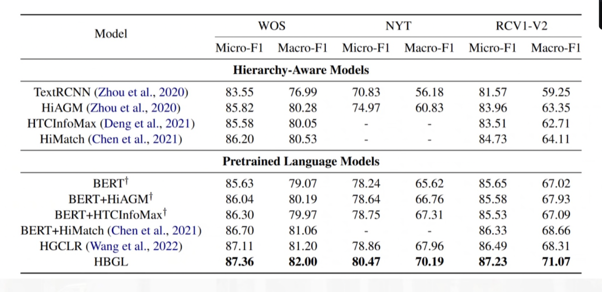

# 1.HTC层次文本分类背景介绍

通常的文本分米要求分到 “外设硬件” 或者“二手交易”，层次分类是按照 “1T软硬件”＞ “二手交易” 进行分类

层次文本分类(Hierarchical Text Classification， HITC)是一种特殊的多标签文本分类问题，需要从分类层次以自顶向下的方式(Sun和Lim，2001)构建一条或多条路径。与多标签文本分类相比，HTC侧重于利用层次信息来达到更好的效果。

局部方法：通过在每个层次或层次中的每个节点构造一个或多个分类器来利用层次信息，般而言，一个文本样本会按照其层级自上而下进行分类。

全局方法通过直接将HTC视为以层次信息为输入的多标签文本分类来利用层次信息。

# 2.模型结构

# 3.全局层次感知标签embeddings

全局层次感知的标签embedding旨 在根据HTC中的标签语义和层次结构初始化标签embedding

这部分的目的是希望模型学会标签的语义，通过MLM训练帮助BERT学习语义，通过标签含义初始化

embedding向量：标签含义是“体育”，就把“体”和“育”的embedding相加作为标签的初始化。

预训练阶段，bert和roberta的词embedding通常是word embeddingtposition embeddingtsegment embedding

同一层次的标签对应的position embedding是一样的（体育为1，足球、篮球为2）

所有标签的segment embedding都设为1

问题：如果在BERT里面直接遵循MIM任务，会导致BERT无法区分相同父标签下的掩码叶子标签

例如-足球和棒球都在体育下面，拥有相同的position embedding和segment embedding，如果两个叶子掩盖，模型将会输出相同的结果

为此，将masked label prediction任务看作多标签分类，论文把预测目标转化成了预测被mask符号的兄弟。

首先，在等式1中用mask token embedding替代y来随机掩码多个标签，其次，计算隐状态表示h和每个标签s的

分数：

其中BERTEncoder是BERT的编码器部分，^应用于BERTEncoder的每一层。最后，将之前的问题转化为求解如

下优化问题：

# 4.局部层次结构学习阶段

与全局层次不同，局部层次是动态的，与语义信息相关。

局部层次表示：根据BERT的注意力机制将局部层次表示为全局层次的子图,采用如下的方法将多路径的层次结构转换为序列：

