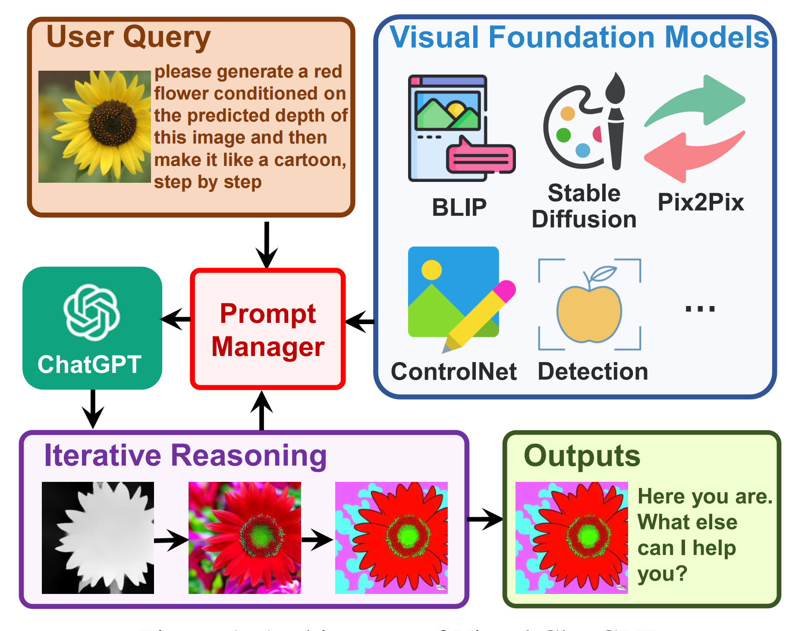

# 1 Background

## 1.1 Issue

1)ChatGPT是用语言训练的，它目前还不能处理或生成来自视觉世界的图像

2)视觉基础模型，如视觉变形器或稳定扩散，虽然表现出很强的视觉理解和生成能力，但它们只是具有一轮固定输入和输出的特定任务的专家。

## 1.2 Improvement

使用户能够通过以下方式与ChatGPT进行交互:

1)不仅发送和接收语言，还**发送和接收图像**

2)**提供复杂的视觉问题或视觉编辑指令**，这些指令需要多个人工智能模型通过多个步骤进行协作  

3)**提供反馈并要求纠正结果**。考虑到多输入/输出模型和需要视觉反馈的模型，设计了一系列提示来将视觉模型信息注入ChatGPT。

## 1.3 Funny Story

能建立一个类似ChatGPT的系统来支持图像理解和生成吗？

- 一个直观的想法是训练多模态对话模型。然而，建立这样一个系统将消耗大量的数据和计算资源。

如果我们想融合语言和图像之外的模式，比如视频或声音，会怎么样？每当遇到新的模态或功能时，有必要训练一个全新的多模态模型吗？

- 不是从头开始训练一个新的多模态ChatGPT，而是直接基于ChatGPT构建可视化chat GPT，并加入各种视觉基础模型- 

工作将CoT的潜力扩展到大量任务，包括但不限于文本到图像生成、图像到图像翻译、图像到文本生成等

  

  